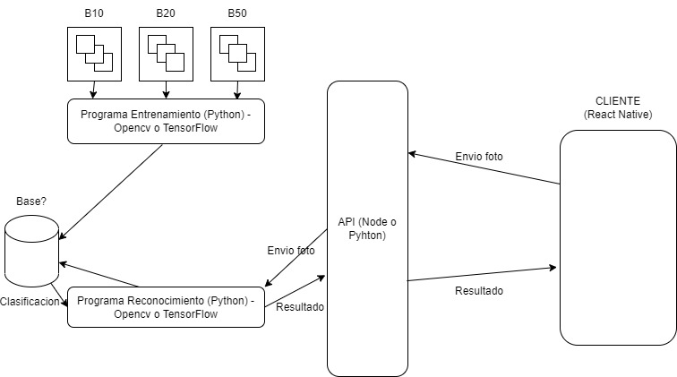

<!--
Hey, thanks for using the awesome-readme-template template.  
If you have any enhancements, then fork this project and create a pull request 
or just open an issue with the label "enhancement".

Don't forget to give this project a star for additional support ;)
Maybe you can mention me or this repo in the acknowledgements too
-->
<div align="center">

  <!---->
  <h1>API</h1>
  
  <!--<p>
    An awesome README template for your projects! 
  </p>-->
  
  
<!-- Badges -->
<p>
  <a href="https://github.com/VisionReact/api/graphs/contributors">
    
  </a>
  <a href="https://github.com/VisionReact/api/stargazers">
    
  </a>
  <a href="https://github.com/VisionReact/api/issues">
    
  </a>
  <a href="https://github.com/VisionReact/api/blob/main/LICENSE">
    
  </a>
</p>
  <!-- 
  <h4>
    <a href="https://github.com/Louis3797/awesome-readme-template/">View Demo</a>
  <span> · </span>
    <a href="https://github.com/Louis3797/awesome-readme-template">Documentation</a>
  <span> · </span>
    <a href="https://github.com/Louis3797/awesome-readme-template/issues/">Report Bug</a>
  <span> · </span>
    <a href="https://github.com/Louis3797/awesome-readme-template/issues/">Request Feature</a>
  </h4>-->
</div>

<br />

<!-- Table of Contents -->
# :notebook_with_decorative_cover: Table of Contents

- [:notebook_with_decorative_cover: Table of Contents](#notebook_with_decorative_cover-table-of-contents)
  - [:star2: About the Project](#star2-about-the-project)
    - [:camera: Screenshots](#camera-screenshots)
    - [:space_invader: Tech Stack](#space_invader-tech-stack)
    - [:key: Environment Variables](#key-environment-variables)
  - [:toolbox: Getting Started](#toolbox-getting-started)
    - [:bangbang: Prerequisites](#bangbang-prerequisites)
    - [:test_tube: Running Tests](#test_tube-running-tests)
    - [:running: Run Locally](#running-run-locally)
  - [:wave: Contributing](#wave-contributing)
  - [:handshake: Contact](#handshake-contact)
  - [:gem: Acknowledgements](#gem-acknowledgements)
  <!--* [Installation](#gear-installation)-->
  <!--* [Running Tests](#test_tube-running-tests)
  * [Run Locally](#running-run-locally)-->
  <!--* [Deployment](#triangular_flag_on_post-deployment)-->
- [Contact](#handshake-contact)
- [Acknowledgements](#gem-acknowledgements)

  

<!-- About the Project -->
## :star2: About the Project


<!-- Screenshots -->
### :camera: Screenshots

<div align="center"> 
  
</div>


<!-- TechStack -->
### :space_invader: Tech Stack

<details>
  <summary>Server</summary>
  <ul>
    <li><a href="https://developer.mozilla.org/es/docs/Web/JavaScript">JavaScript</a></li>
    <li><a href="https://expressjs.com/">Express.js</a></li>
  </ul>
</details>

<details>
<summary>Database</summary>
  <ul>
    <li><a href="https://www.mysql.com/">MySQL</a></li>
    <!--<li><a href="https://redis.io/">Redis</a></li>-->
  </ul>
</details>

<!--<details>
<summary>DevOps</summary>
  <ul>
    <li><a href="https://www.docker.com/">Docker</a></li>
    <li><a href="https://www.jenkins.io/">Jenkins</a></li>
    <li><a href="https://circleci.com/">CircleCLI</a></li>
  </ul>
</details>-->


<!-- Env Variables -->
### :key: Environment Variables

To run this project, you will need to add the following environment variables to your .env file

`API_KEY`

`ANOTHER_API_KEY`

<!-- Getting Started -->
## 	:toolbox: Getting Started

<!-- Prerequisites -->
### :bangbang: Prerequisites

This project uses npm as package manager

```bash
 npm i
```
   
<!-- Running Tests -->
### :test_tube: Running Tests

To run tests, run the following command

```bash
  npm test test
```

<!-- Run Locally -->
### :running: Run Locally

Clone the project

```bash
  git clone https://github.com/VisionReact/api
```

Go to the project directory

```bash
  cd api
```

Install dependencies

```bash
  npm install
```

Start the server

```bash
  npm start
```


<!-- Deployment -->
<!--### :triangular_flag_on_post: Deployment

To deploy this project run

```bash
  yarn deploy
```-->


<!-- Contributing -->
## :wave: Contributing

<a href="https://github.com/VisionReact/api/graphs/contributors">
  
</a>


Contributions are always welcome!


<!-- Contact -->
## :handshake: Contact

VisionReact - reactnative203@gmail.com

Project Link: [https://github.com/VisionReact/api](https://github.com/VisionReact/api)


<!-- Acknowledgments -->
## :gem: Acknowledgements

Use this section to mention useful resources and libraries that you have used in your projects.

 - [Shields.io](https://shields.io/)
 - [Awesome README](https://github.com/matiassingers/awesome-readme)
 - [Emoji Cheat Sheet](https://github.com/ikatyang/emoji-cheat-sheet/blob/master/README.md#travel--places)
 - [Readme Template](https://github.com/othneildrew/Best-README-Template)

